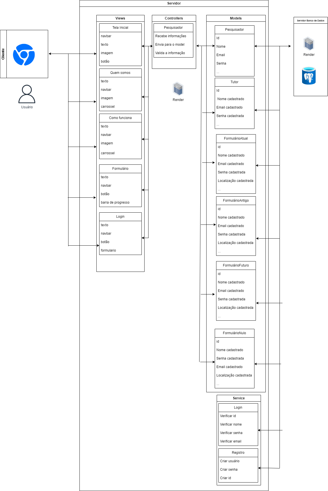
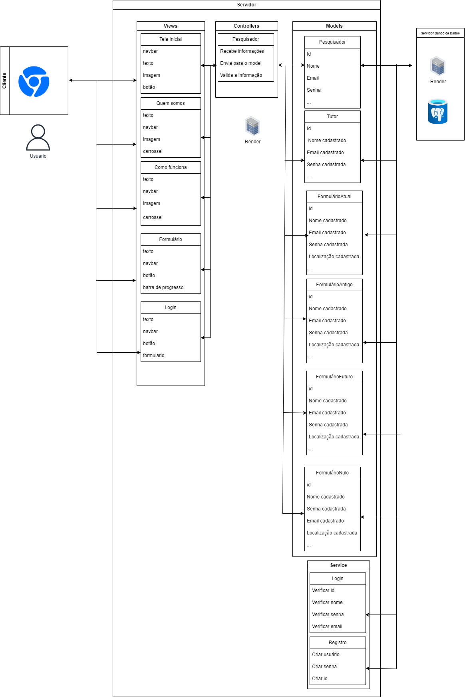

### Arquitetura MVC:

 __Nome do projeto:__  Abandono zero

- __Descrição:__ Estamos criando um website com um questionário que terá como objetivo coletar dados de usuários que tem, tiveram ou terão cachorros. Esses dados serão armazenados e posteriormente utilizados pelo INSPA, para entender melhor o contexto de abandonos de cachorros e dessa forma tomar medidas efetivas baseadas em dados para acabar com esse problema. 

- __Arquitetura:__ MVC (Model-View-Controller)

- __Ferramenta de Diagramação:__ Draw io

### Tutor

### Modelos (Models):

- Entidades:

__Usuário:__

Atributos: ID, nome, email, idade, se possui, tinha ou terá cachorro.

__Formulário:__

Atributos: ID do usuário, nome do usuário, resposta do usuário.

__Relações:__

- Um usuário pode ter vários cachorros.

- Um cachorro pode estar relacionado a apenas um usuário.

- Um usuário pode responder a várias perguntas do questionário.

### Controladores (Controllers):
- Tutor Controller:

__Responsabilidades:__
1) Receber informações do formulário de cadastro de usuário.
2) Validar e armazenar os dados do usuário no banco de dados.
3) Receber as respostas do questionário.
4) Validar e armazenar as respostas no banco de dados.

__Métodos:__

Registro: nome, email, senha e localização.

### Pesquisador:

### Modelos (Models):

- Entidades:

__Responsabilidades:__

1) Receber informações do formulário de cadastro de cachorro.

2) Associar o cachorro ao usuário correspondente.

3) Armazenar os dados do cachorro no banco de dados.

__Métodos:__ 

__Registro:__ ID, nome, email, senha e localização.

__Formulário:__ nome, questão e pergunta.

__Views (Views):__

1) Navbar: Facilita a navegação pelo site, fornecendo links para diferentes seções.

2) Textos: Explicam o propósito do projeto e instruções para os pesquisadores.

3) Imagem (com carrossel): Oferece uma experiência visual agradável e cativante.

4) Botões: Permitem navegar entre as diferentes partes da plataforma e baixar os dados dos usuários.

5) Formulário: Principal componente para coletar dados dos usuários.

### Infraestrutura:
__Banco de Dados:__ Utilizar um banco de dados relacional para armazenar os dados dos usuários, cachorros e respostas do questionário.

__APIs externas:__ Utilizar APIs externas para obter dados adicionais sobre raças de cachorros e estatísticas de abandono.

__Integração com MVC:__

1) Os controladores interagem com os modelos para acessar e manipular os dados.

2) As views são renderizadas pelos controladores e exibem as informações aos usuários.

3) A infraestrutura, como o banco de dados e as APIs externas, é acessada pelos modelos e controladores conforme necessário.

__Justificativa e Implicações da Arquitetura:__
- A escolha do padrão MVC ajuda a separar as preocupações do projeto, facilitando a manutenção e a escalabilidade.

- A separação clara entre modelos, controladores e visualizações torna o código mais organizado e fácil de entender.

- A arquitetura MVC facilita a testabilidade do projeto, pois as diferentes partes podem ser testadas de forma independente.

- Com essa arquitetura, o projeto "Abandono Zero" estará bem estruturado e pronto para coletar e utilizar dados importantes para combater o abandono de cachorros de forma eficaz.